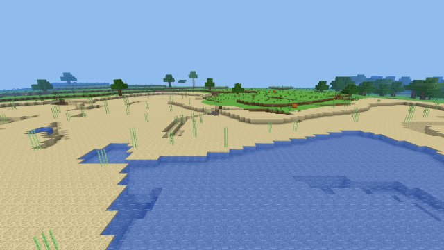
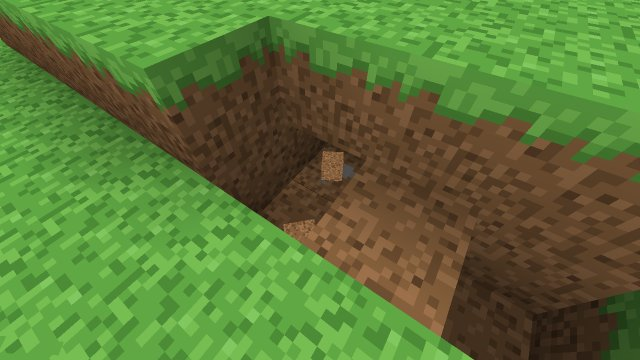
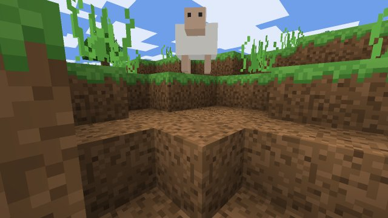
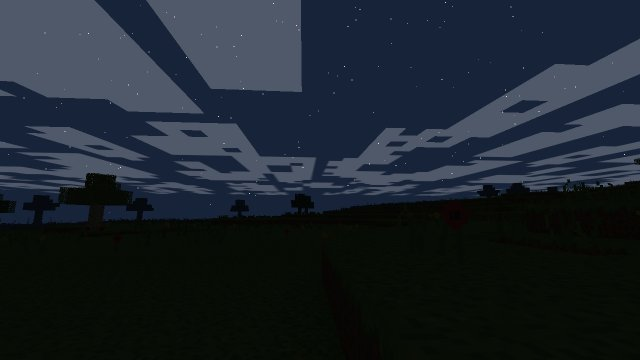

# BlockVerse

**An open-source voxel sandbox game that runs entirely in your browser.**

Explore an infinite procedurally generated world. Mine blocks, craft tools, smelt ores, build anything, survive the night. No installs, no accounts, no servers — your worlds are saved locally in your browser.

> 🎮 **[Play it now →](https://appleweiping.github.io/blockverse/)**

BlockVerse is an original, from-scratch implementation of the classic voxel-sandbox genre, in the spirit of games like Minecraft. It is an unofficial fan project, **not affiliated with, endorsed by, or connected to Mojang or Microsoft** in any way. Every line of code is original, and every texture and sound is **generated procedurally at runtime** — the project ships zero image or audio assets.



| Mining & drops | Mobs | Night |
| --- | --- | --- |
|  |  |  |

---

## Features

### 🌍 Infinite procedural world
- Seed-driven, fully deterministic terrain — the same seed always produces the same world
- **10 biomes**: plains, forest, birch forest, snowy tundra, snowy forest, desert, swamp, mountains, ocean and winding **rivers** (plus beaches), with dithered borders; cold water freezes over and cold mountain ranges are snowbound
- Multi-octave gradient-noise terrain with rolling hills, regional mountain ranges with snow caps, erosion-controlled roughness, and flattened swamps
- **Cave systems**: winding spaghetti tunnels and large "cheese" caverns deep underground, with flooded lower depths, mushrooms and mossy patches; tunnels narrow near the surface so hillsides stay intact and never breach the seabed
- **Dungeons**: rare mossy-cobblestone rooms where caves run into them, each with a **monster spawner** (zombies, skeletons or spiders that keep coming until you break the cage) and one or two chests of loot
- **Desert temples**: sandstone pyramids with corner towers; dig through the chiseled square in the hall floor to find a sealed vault of four treasure chests
- **Forest temples**: overgrown, crumbling two-storey ruins in forests and swamps, often with a spider spawner below and a sanctum up on the terrace
- **Shrines**: small pillared pavilions dotted across the land with an offering chest, built from local materials (sandstone in the desert, spruce in the snow)
- Structures keep their distance from each other, and trees grow around them rather than through them
- Shipwrecks full of cargo and crumbling ocean ruins on the sea floor, wells in the desert, and fossils buried deep beneath deserts and swamps
- Kelp forests and seagrass under the sea, lily pads on shallow swamp pools, snow blankets on the tundra, and lava pooling in the deepest caves
- Decoration follows the biome under every tree and flower: river banks are wooded and grassy, sugar cane lines any water's edge, and mossy boulders dot mountains and tundra
- Worlds remember their generator version, so terrain improvements only apply to new worlds and old ones never develop seams
- **Ores by depth**: coal, iron, gold, redstone, and diamond, each with its own distribution band
- Trees (oak, birch, spruce), cacti, sugar cane, flowers, tall grass, pumpkins, mushrooms — features generate seamlessly across chunk borders
- Chunks (16×128×16) stream in and out around the player; terrain generation runs in a **Web Worker pool** so the main thread never stutters

### 💡 Real voxel lighting
- Two-channel 0–15 light engine: **sky light** and **block light**, flood-filled with BFS across chunk borders
- Incremental relighting when any block is placed or broken — dig into a cave and darkness falls correctly
- Torches, glowstone, and lit furnaces cast light; the day/night cycle modulates sky light in the shader
- **Smooth lighting + per-vertex ambient occlusion** for that soft, grounded look

### ⛏️ Survival gameplay
- Break any block with correct per-block hardness, tool classes (pickaxe / axe / shovel / sword / spear) and five tool tiers (wood, stone, iron, gold, diamond) with durability
- Item drops with physics that magnetize toward you and merge into your inventory
- **Crafting**: 2×2 personal grid and a 3×3 crafting table, with shaped (including mirrored) and shapeless recipes — tools, torches, chests, beds, building blocks and more
- **Recipe book** beside every crafting grid: search and categories, shape previews, ghost layouts for recipes you can't make yet, and one-click grid filling
- **Campfire** (sticks, coal/charcoal, logs): cooks four raw foods at once with no fuel, glows, smokes, and burns anyone standing in it; shovel to put out, torch to relight
- **Smelting guide** beside the furnace that loads ingredients and the right amount of fuel in one click
- Inventory comforts: drag to split stacks across slots, double-click to gather a stack, shift-click quick moves
- Storage blocks (iron, gold, diamond, coal), paper → books → bookshelves, jack o'lanterns, bowls and mushroom stew, charcoal
- First-time **survival tips** that guide you from punching a tree to your first pickaxe, furnace, chest and bed
- **Furnace** with fuel + smelt time, live progress bars, and a lit block state that emits light: smelt iron, gold, glass, stone, bricks, and cook food
- Health, hunger, saturation & exhaustion, drowning with an air meter, fall damage, starvation — plus food to eat
- **Chests** (27 slots) for storage; containers spill their contents when broken
- **Beds**: sleep through the night when no monsters are near, and respawn at your bed
- **Saplings** drop from leaves and grow into new trees
- **Farming**: tall grass drops seeds; till grass with a hoe, plant wheat on farmland (faster near water), bake bread, and speed things up with bone meal (which also grows grass and flowers). Sugar cane and cactus grow taller over time
- **Building shapes**: ladders you can climb, two-high oak doors and fence gates that open and shut, fences and glass panes that link up, stairs and slabs (oak, cobblestone, stone brick) you can walk up, and signs you can write on
- **Flint and steel** lights fires, TNT and campfires; a **fishing rod** lands fish (and the odd treasure) when the bobber ducks under; snowballs and eggs can be thrown (an egg may hatch a chick); worn tools mend when two are crafted together
- **Buckets**: scoop up and pour water and lava (lava meeting water turns to obsidian) and milk cows
- **Fire**: lava sets you alight; jump in water (or drink milk) to put it out. Burning mobs show flames
- **Eating takes a moment**: hold use to eat or drink (you slow down while you do); dried kelp is a quick snack
- **Shears** (two iron ingots): shear sheep for 1–3 wool (the fleece grows back) and snip leaves, tall grass and dead bushes to collect them whole
- **Weapons with weight**: every weapon recovers between swings (a meter under the crosshair shows it) and spamming only taps. Falling blows land **critical hits**, swords **sweep** mobs beside the target, axes hit hardest but slowest, and **spears** (all five materials) reach further and knock foes back
- **Ancient Blade**: a rare temple-only sword stronger than diamond; **golden apples** (crafted from gold and an apple, or found in temples) restore hunger and four hearts
- **Bow and arrows**: draw to charge, release to fire; arrows are crafted from flint (from gravel), sticks and feathers, and can be picked back up
- **Armour**: leather, iron, gold and diamond helmets, chestplates, leggings and boots, with an armour bar, damage reduction and wear
- **TNT** from gunpowder and sand, lit with a torch — chain reactions included
- Dying drops your inventory where you fell (or keep it — chosen per world); a day counter tracks how long you've survived
- **Creative mode**: flight (double-tap space), instant breaking, a searchable item palette with categories, no damage

### 🐷 Mobs
- **Farm animals** by biome: pigs, sheep, cows (leather, beef) and chickens (feathers, chicken) wander, flee when hit and drop food
- **Breeding**: feed two animals their favourite food (wheat for cows and sheep, seeds for chickens, apples for pigs) and they'll have a baby that grows up in a few minutes; animals you've fed are kept and saved with your world instead of wandering off
- Mobs jostle each other and get shoved aside instead of stacking up inside one another
- **Dolphins** play in the open ocean in pods: they swim over to you, leap from the waves and give swimmers near them a burst of speed (feed one a fish and it escorts you). Gentle **manatees** graze in warm rivers, swamps and shallow coasts, drifting up to breathe
- **Wildlife**: foxes (wary of people, hunt chickens), birds that flit between the treetops, fish in any water (they flop and suffocate on land) and whales in the deep ocean
- **Pets**: tame dogs with bones and cats with raw fish. Pets follow you, sit on command, are saved with your world, and catch up if you leave them behind. Dogs fight monsters near you; creepers flee from cats
- **Zombies** spawn in darkness, chase you, hit hard, and burn in the morning sun
- **Skeletons** keep their distance and shoot arrows (and burn in daylight); they drop bones
- **Spiders** are fast and climb walls; they only hunt in the dark unless provoked, and drop string
- **Husks** stalk the desert unburnt by the sun, **drowned** rise from the water at night, and the odd fast **baby zombie** turns up
- **Creepers** sneak up, hiss and explode, blasting holes in the terrain; they drop gunpowder
- Monsters need to see you (they remember you for a few seconds round a corner), ignore creative players, knock you back when they hit, work their way around walls, haunt dark caves at any hour, and groan, rattle or hiss as they approach
- **Difficulty** per world — Peaceful, Easy, Normal or Hard — changeable any time with `/difficulty`
- Original box-model creatures with walk animations, knockback, fall damage, and voxel-light-aware shading

### 🌗 Living environment
- Full **day/night cycle** (20 min) with sunrise/sunset color grading, a sun and a moon, drifting blocky clouds, and a starfield at night
- Distance fog that follows your render-distance setting; underwater the view tints blue, darkens with depth and at night, and bubbles rise from you

### 🖥️ Complete game shell
- Main menu with **multiple worlds**: create (name + text/number seed + game mode), play, rename, delete
- **Saving is automatic** (IndexedDB): modified chunks, player state, inventory, time of day, and furnace contents all persist
- Pause menu with a controls cheat sheet, settings (render distance, FOV, brightness, master + per-category volume, view bobbing, crosshair style, GUI scale, FPS counter, fullscreen, mouse sensitivity, invert Y, rebindable keys — applied live), death screen, loading screen
- World list with search, sorting, duplicate, export/import (a .json file you can back up or share) and copy-seed; chat with Tab completion and `/summon`
- **Gamepad** and **touch** controls, both covering gameplay, menus and inventories
- HUD: hotbar with icons & durability bars, pixel-art hearts / hunger / air bubbles, crosshair, block-break cracks and selection outline, damage and low-health vignette
- First-person held item (or bare arm) with walk bob, swing and equip animations, lit by the surrounding light
- **F3 debug overlay**: FPS, position, chunk, biome, light levels, draw calls, triangle count
- **Chat & command console**: `/tp`, `/time set`, `/give`, `/gamemode`, `/seed`, `/heal`, `/rd`, and more

### 🎨 100% procedural assets
- Every block, item, and tool texture is **pixel art drawn by code** into a texture array at startup (mipmap-safe, no bleeding)
- Inventory icons are rendered as tiny isometric cubes from the same tiles
- All sound effects — digging, footsteps per material, hurt, eating, splashes, UI clicks — are **synthesized live with WebAudio**. There are no asset files in the repository at all.

---

## Controls

| Input | Action |
| --- | --- |
| **W A S D** | Move |
| **Mouse** | Look |
| **Left click** | Mine block / attack |
| **Right click** | Place block / use (crafting table, furnace) / eat |
| **Space** | Jump / swim up (double-tap in creative: toggle flight) |
| **Ctrl** / double-tap **W** | Sprint (underwater: swim fast where you look) |
| **Shift** | Sneak (you won't fall off edges) / fly down / dive |
| **1–9 / mouse wheel** | Select hotbar slot |
| **E** | Inventory (creative: item palette) |
| **Q** | Drop held item (Ctrl+Q: whole stack) |
| **Middle click** | Pick block |
| **T** or **/** | Chat / command console |
| **F1** | Hide HUD |
| **F2** | Save a screenshot |
| **F3** | Debug overlay |
| **Esc** | Pause |

All keys can be rebound in **Settings → Controls**. **Gamepads** and **touch screens** are supported too (menus and inventories included). Full details in [docs/CONTROLS.md](docs/CONTROLS.md).

## Commands

```
/help                       list commands
/tp <x> <y> <z>             teleport
/time set <day|noon|night|midnight|0..1>
/give <item> [count]        e.g. /give diamond_pickaxe
/gamemode <survival|creative>
/difficulty <peaceful|easy|normal|hard>
/seed  /spawn  /kill  /heal  /clear
/rd <2-16>                  render distance
```

---

## Running locally

Requirements: Node.js ≥ 20.

```bash
git clone https://github.com/appleweiping/blockverse.git
cd blockverse
npm install
npm run dev       # dev server at http://localhost:5173
npm run build     # production build into dist/
npm run preview   # serve the production build
```

The `main` branch auto-deploys to GitHub Pages via [GitHub Actions](.github/workflows/deploy.yml).

## Architecture

```
src/
├── main.js            app shell: menus <-> game lifecycle
├── game.js            Game: loop, camera, day cycle, input wiring, saving
├── core/              constants, seeded RNG, gradient noise, input, AABB physics
├── blocks/            block registry (hardness, tools, drops, light, render kind)
├── items/             item registry, crafting recipes, smelting, furnace logic
├── world/             chunks, streaming world, worker pool, worldgen, lighting, raycast
├── workers/           terrain-generation web worker
├── render/            procedural textures, texture-array atlas, chunk mesher (AO +
│                      smooth light), GLSL3 chunk materials, sky, block highlight
├── player/            player physics/stats/inventory, block interaction
├── entities/          item drops, mobs (pig/sheep/zombie), AI, spawner
├── ui/                HUD, container screens, chat/commands, menu screens
├── audio/             WebAudio sound synthesis
└── save/              IndexedDB world/chunk/player persistence, settings
```

Key design points (full write-up in [docs/ARCHITECTURE.md](docs/ARCHITECTURE.md)):

- **Chunks** store blocks as flat `Uint16Array`s with column-contiguous layout; meshes rebuild incrementally with a per-frame time budget, nearest-first.
- **Terrain workers**: a pool of Web Workers generates raw chunk data off-thread and transfers it back zero-copy. Decorations that cross chunk borders (trees) are re-derived deterministically by every chunk they touch, so there are no seams.
- **Lighting** is the classic two-queue BFS: light removal enqueues re-fill sources; skylight propagates downward loss-free at level 15. All updates cross chunk borders.
- **Meshing** emits per-vertex sky/block light with ambient-occlusion, flipping quad diagonals to avoid AO anisotropy; leaves/glass render alpha-tested in the opaque pass, water alpha-blends with a lowered surface.
- **Textures** live in a `DataArrayTexture` (one layer per tile), which makes mipmapping safe — no atlas bleeding at distance.
- **Saves**: only chunks you actually modified are written; everything else regenerates from the seed.

## Performance notes

- Render distance is configurable (2–16 chunks). The default 8 gives ~300–600 draw calls and a few hundred thousand triangles depending on terrain.
- Heavy work (generation) is off-thread; lighting and meshing are time-sliced on the main thread with a per-frame budget.
- If the tab is hidden, a worker-driven ticker keeps the world simulating (browsers throttle hidden-tab timers).

## Roadmap

Ideas that would fit the engine as it stands:

- Flowing water & lava simulation
- Redstone-style logic circuits
- More structures (villages, strongholds) via the deterministic feature system
- Multiplayer over WebRTC
- Height-4096 worlds with cubic chunks

Contributions are welcome — the codebase is dependency-light (three.js + Vite only) and every module is documented.

## License & IP

- Code: [MIT](LICENSE).
- All textures, models, and sounds are procedurally generated originals created for this project, and are covered by the same MIT license.
- BlockVerse is an original work inspired by the voxel-sandbox genre. It is **not** affiliated with, endorsed by, or connected to Mojang, Microsoft, or *Minecraft*. No assets, code, or other material from *Minecraft* are used.
